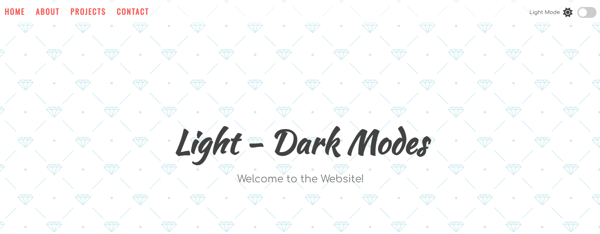
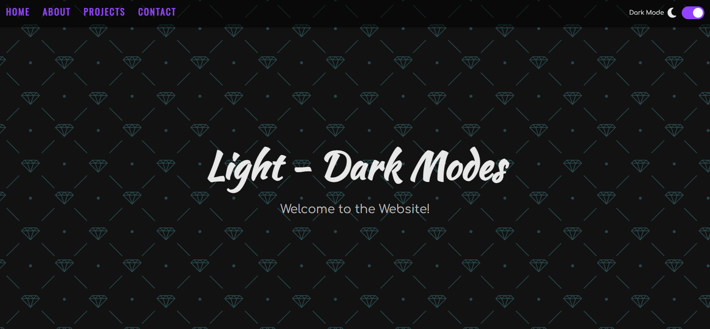

# Light Dark Mode

A beginner-friendly project that allows users to switch between **light** and **dark** themes with a simple toggle button. Built using vanilla HTML, CSS, and JavaScript.

---
## Project Goal

To practice DOM manipulation and CSS custom properties by implementing a dynamic theme switcher that updates the appearance of the entire page instantly.

---
## Features

- Toggle between light and dark mode
- Theme state persists using `localStorage`
- Uses CSS variables (`--color`) for easy styling
- Smooth transition between themes

---
### Demo

**Live Demo**: _[live demo](https://abdo-rabea.github.io/light-dark-mode)_  
**Preview**: 



---
## Technologies Used

- HTML5
- CSS3 (with custom properties)
- Vanilla JavaScript (no libraries)

---
## How to Use Locally

1. **Clone the repo**
    
```bash
git clone https://github.com/abdo-rabea/light-dark-theme.git
```

2. **Open the folder**

```bash
cd light-dark-theme
```

3. **Open `index.html` in your browser**, or run with a Live Server extension